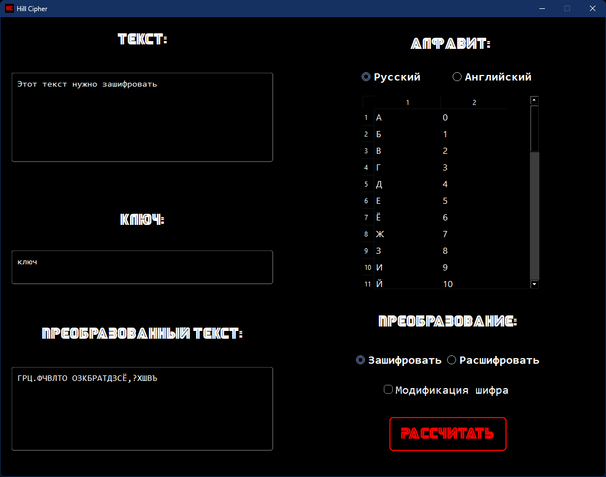

# Шифр Хилла

## Описание программы

Данная программа позволяет шифровать введённый текст (на русском или английском языке) с помощью алгоритма шифрования (шифр Хилла). В программе также предусмотрено шифрование с использованием модификации данного алгоритма.

### Описание модификации

В качестве идеи для модификации алгоритма было принято решение выполнять с каждым блоком текста перед умножением на матрицу ключа следующие действия: прибавлять к каждому элементу матрицы столбца блока исходного текста соответствующее число из диагонали матрицы ключа, после этого сдвигать элементы в матрице столбце на один элемент влево, чтобы получить циклическую перестановку. Для дешифрования будет необходимо выполнить обратные действия.

## Запуск программы

Для запуска программы установите все зависимости из `requirements.txt`. Выполните команду `python -m main` для запуска программы.

## Пример работы программы

